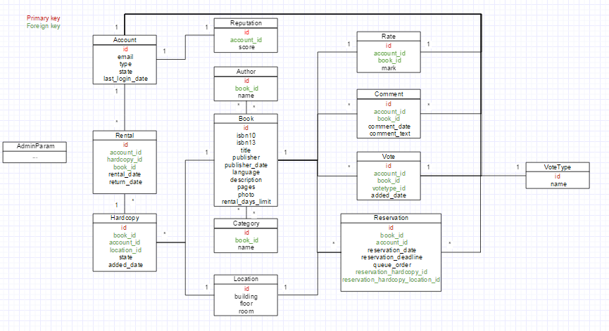

Database
========

Tables
------

- Account: 
    - Logs registered in Amundi directory, accounts managed by external module
    - We can lock/unlock an account 
    - We can upgrade an account   
    - 2 types: Admin or User
    
- Borrow: Link between Account and Hardcopy
    - In config file, we can choose between unlimited or limited borrow delay.return_date can thus be NULL.
    - When borrow is finished, hardcopy_id will be NULL

- Reservation: Link between Account and Book
    - Waiting list with "Order"
    - The first in waiting list has several days to pick the book. If deadline is passed, the first become the last. Deadline value is set in config file.
    - When the book is available, the reservation sets harcopy_id and location

- Hardcopy: 
    - "Location" -> To know where this sample is (deposit)
    - "State" -> "Available", "Booked", "Borrow", ...
    - Register who bring this hardcopy to allow him to get it back
    
- Book: General description
    - "borrow_days_limit" -> We can configure borrow_days_limit by books (if it's not unlimited)
    
- Author/Category:
    - Match with a book
    
- Location: 
    - Table which stores deposit addresses
    
- Comment: Link between Account and book, to give comments about a book

- VoteType: Table which stores vote types (like, favorite, ...)

- Vote: User can vote for a book (like, add to favorite, ...)

- Rate: User can put a mark on a book

- Reputation: User have a reputation. If he doesn't return the book, the reputation is reduced.
If someone has a very low reputation, his account might be locked.

