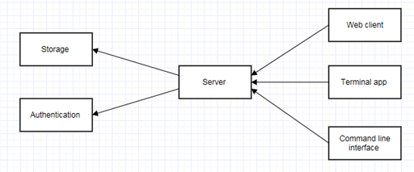

Subsystem diagram
=================

Storage
-------

Relational database (MySQL, SQLite, ...)   

See [database.md](database.md)

Authentication
--------------

A pluggable, configurable, locale-independent authentication system.

- Configuration is possible through backends that implement a common interface

- Planned backends with configuration examples:    
    - database    
    - Web service    
    - File (mail:password)    

- Authorization:
    - Backend provides groups or roles of authenticated users    
    - Configuration defines:    
        - Allowed user groups    
        - Admin groups    
 
- No local user management:
    - Adding / deleting / modifying users should be managed externally, by the owners of the backend     
    - Locking/unlocking users option is available
    

Server
------

The connecting point between clients and backends.
All communications between clients and Storage must go through the server.

- The REST API is the only public interface (NodeJS)    

See [rest.md](rest.md)

Terminal app
------------

A hand-held device to interact with the library,
installed at each physical bookshelf.

- Includes ISBN scanner, used when:
    - Registering a new book    
    - Borrowing a book from the bookshelf    
    - Returning a book to the bookshelf    

- Includes login form    

See [terminalapp.md](terminalapp.md)

Web client
----------

A web application which includes all features.   

Features:

- Books/Samples management   
- Books search  
- Reserve/Borrow a book  
- Comments/likes/rates  
- Favorite list  

See [webclient.md](webclient.md)

Command line interface
----------------------

It functions the same way as the web client but all management and views
are handled by the command line. 
