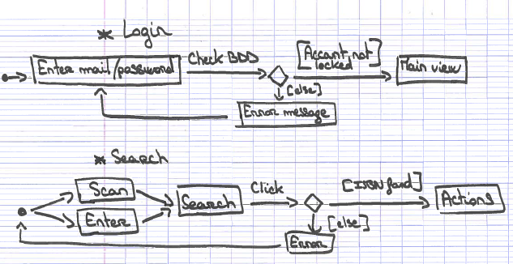
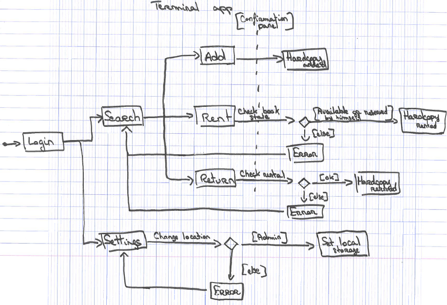

Terminal app
============

In the terminal app, there are four components:

- Scan a book   
- Login panel   
- Main view (activities)   
- Settings view (to change terminal location)    

The general functioning of the terminal (described below) is in order

- Login   
- Scan or enter ISBN to search the book
- Choose an action (add, borrow or return a book)  
- Confirmation panel   
- Disconnect   

There is also an admin feature to change terminal's location in the settings view.

