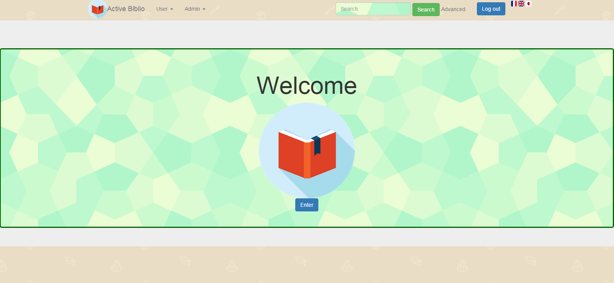
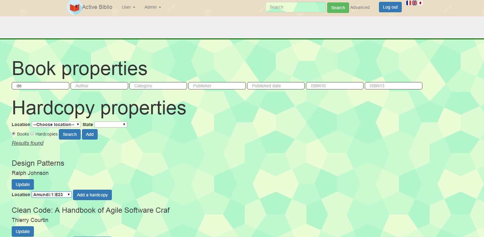
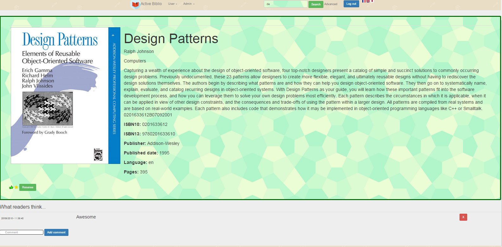

Web client
========

Web client is composed of views, controllers and services.   

Connection
----------

Functions the same way as the terminal app, users have to enter mail and password.   
	

Homepage
--------

On the screen below, there are two parts: 

- Fixed: the top banner (menu, search bar, login, languages).   
- Variable: the body of the page.

Admin
-----

### Functioning

Admin has three extra features, he can manage books, accounts and locations. 
When he clicks on the menu, there are three views:

- AccountHandler: An account list with an option to lock/unlock and another to upgrade, an admin can't have any effect on another admin account.
- BookHandler: An admin can add and update a book and/or a hardcopy. He can also delete a hardcopy.
- LocationHandler: He can add and/or delete a location.

### BookHandler

As we can see, we use the search system to find books or hardcopies. After that, we have choices between set and delete.   
For a hardcopy, admin can add an hardcopy and/or set its state ("Available", "Not Available", "Delayed", ...) and its location.  
For a book, he can set every detail except isbn, add/delete author/category. 

User
----

For an user there are two majors features: look for a book and reserve/rent a book. 
With these features are possibilities to leave a comment, add to favorite this book and like.    

Views: 

- Search
- Specific book
- Favorite list
- Rentals
- Reservations
- Added hardcopies

### Search

Components:

- Search bar, located on the top, search in all book details
- "advanced": Link to a form to search with parameters
- List of books with photo, title, description, rate(stars) and "like" number (not visible here)
- Buttons to reserve, add to favorites

### Specific book

Components:

- Book with title, description, mark and "like" number (not visible here)
- Star to add this book to favorite list
- "Like" icon
- Button to reserve
- Comment panel to see and leave comments (admin can delete a comment)

### Reservation/Rental

In these views, we can see reservations/rentals and manage them (reserve/cancel and/or rent/return).  

Components in all these views:

- Star to add this book to favorite list
- Like icon
- Book information and link to the book details
- Buttons to manage reservations/rentals
